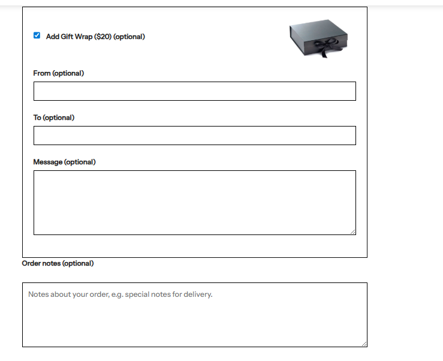
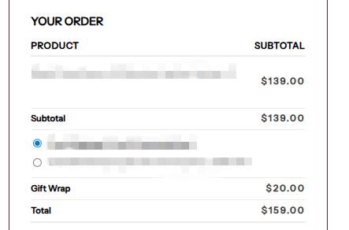
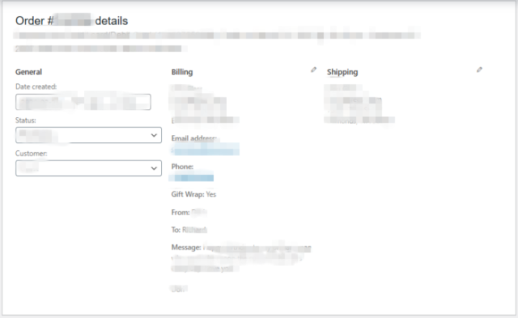

# 🎁 WooCommerce Gift Wrap Plugin

A custom WooCommerce plugin that adds a **gift wrap option** on the checkout page with personalized fields and dynamic pricing.

---

## 🚀 Features

- 🎁 Add Gift Wrap option at checkout
- 📝 Custom fields:
  - From
  - To
  - Message
- 💰 Automatically adds gift wrap fee
- 🧾 Saves data to order meta
- 👨‍💼 Displays gift details in:
  - Admin order panel
  - Thank You page
- ⚡ Lightweight & easy to use

---

## 🛠️ Tech Stack

- PHP (WordPress Plugin Development)
- WooCommerce Hooks & Filters
- jQuery (Checkout interaction)

---

## 📸 Screenshots

### Checkout Page

### Admin Order View

---

## ⚙️ Installation

1. Download or clone this repository
2. Upload to:
/wp-content/plugins/woocommerce-gift-wrap-plugin
3. Activate the plugin from WordPress admin
4. Go to checkout page → Gift wrap option will appear 🎁

---

## 🧠 How It Works

- Adds a checkbox on WooCommerce checkout
- When selected:
- Displays additional fields (From, To, Message)
- Adds a fixed fee to cart
- Stores all data in order meta
- Displays details in admin and customer confirmation page

---

## 📂 Project Structure
woocommerce-gift-wrap-plugin/
│
├── woocommerce-gift-wrap.php
├── assets/
│ ├── js/
│ │ └── wc-gift-wrap.js
│ └── images/
│ └── gift-box.jpg
├── screenshots/
└── README.md

---

## 💡 Future Improvements

- Admin settings panel (change price dynamically)
- Enable/disable fields toggle
- Multi-language support
- AJAX-based UI improvements

---

## 👨‍💻 Author

**Muhammad Faisal**  
Full Stack Developer (Laravel & WordPress)

📧 mffaisal877@gmail.com  
🔗 https://linkedin.com/in/muhammad-faisal-a618731b1  

---

## ⭐ Support

If you like this project, consider giving it a ⭐ on GitHub!
